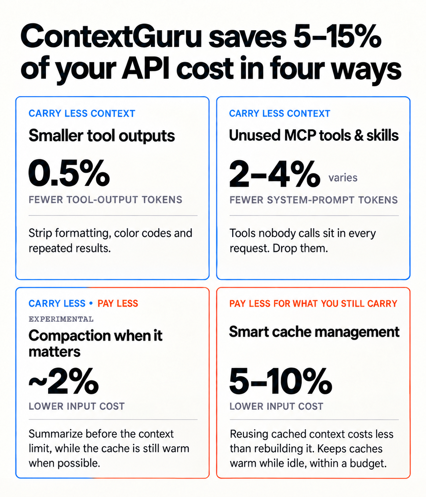

<div align="center">


# context-guru

**Provider-agnostic context engineering for LLM agents.**

**[▶ Watch the demo](https://rossoctl.github.io/context-guru/#demo)**

[](https://rossoctl.github.io/context-guru/)
[](https://pkg.go.dev/github.com/rossoctl/context-guru)
[](LICENSE)
[](go.mod)

</div>

---

context-guru cuts the token cost of your agent's traffic in two ways: **carry less context**
(drop redundant tool output, collapse superseded runs, summarize before you hit the limit), and
**pay less for what you still carry** (keep your prompt cache warm, split the volatile tail off
the system prompt so the rest stays cacheable). Paying less is the **default** — it's on out of
the box, before you opt into anything that trims content.

Full docs: **[rossoctl.github.io/context-guru](https://rossoctl.github.io/context-guru/)**.

<p align="center">

</p>

## Install

Choose your setup. Each button opens only the instructions for that path.

<table>
  <thead>
    <tr>
      <th></th>
      <th>Personal use</th>
      <th>Enterprise use</th>
    </tr>
  </thead>
  <tbody>
    <tr>
      <th>Claude Code</th>
      <td align="center">
        <a href="docs/how-to/install-plugin.md"></a>
      </td>
      <td align="center" rowspan="2">
        <a href="docs/hosted.md#user-setup"></a><br>
        <sub>Claude Code or Codex</sub>
      </td>
    </tr>
    <tr>
      <th>Codex (experimental)</th>
      <td align="center">
        <a href="codex-marketplace/plugins/context-guru/README.md"></a>
      </td>
    </tr>
  </tbody>
</table>

For local Codex use, register only the marketplace paths Codex needs; cloning the whole monorepo
can exceed Codex's marketplace timeout:

```sh
codex plugin marketplace add rossoctl/context-guru --sparse .agents --sparse codex-marketplace
codex plugin add context-guru@context-guru
```

## Presets

It's an effort ladder — each tier is everything in the one before it, plus more:

| Preset | What it adds | Spends on its own |
|---|---|---|
| `off` | nothing — requests forwarded untouched (the default; only keep-alive spends, if that's on) | no |
| `conservative` | deterministic trimming of tool output (repeats, dead runs) — no model calls | no |
| `medium` | `conservative` plus a cheap model that keeps only what looks relevant in recent tool output | yes |
| `high` | `medium` plus a summarizer that compacts older turns once the context window is nearly full | yes |
| `xhigh` | `high` plus a periodic deep-adjudication sweep over turns whose prompt cache has gone cold — the deepest cut | yes |

Run the picker any time to switch tiers—it explains each one before asking which to set:

| Claude Code | Codex (experimental) |
|---|---|
| `/context-guru:preset-picker` | `$context-guru-preset-picker` |

Claude Code applies the change at the next proxy start; Codex restarts its owned proxy after the
selection. Confirm the result with `/context-guru:status` on Claude Code or
`$context-guru-status` on Codex. Full pipelines:
[docs/reference/presets.md](docs/reference/presets.md).

Everything else — architecture, the full benchmark, every component, the proxy/gateway path,
config reference — is in **[docs/design.md](docs/design.md)** and
**[docs/get-started/how-it-saves.md](docs/get-started/how-it-saves.md)**.

## Updating

The proxy **binary** is what matters and what changes often. Claude Code checks for a newer release
in routed sessions and offers update choices; Codex checks when you invoke its update skill. Update
it any time with the command for your client:

| Claude Code | Codex (experimental) |
|---|---|
| `/context-guru:update` | `$context-guru-update` |

Codex does **not** check or install proxy updates automatically. Codex users should run
`$context-guru-update` periodically. It checks only; when an update is available, exit Codex and
run `~/.local/state/context-guru-codex/context-guru-update` in an ordinary shell, then start a new
session.

**The plugin itself** (skills, hooks, scripts) rarely needs updating — most releases only touch the
proxy binary, which the update command above already covers. To refresh the plugin itself:

| Claude Code | Codex (experimental) |
|---|---|
| `/plugin marketplace update rossoctl/context-guru`<br>`/reload-plugins` | `codex plugin marketplace upgrade context-guru`<br>Then restart Codex. |

More: [docs/how-to/install-plugin.md](docs/how-to/install-plugin.md#upgrading).

## Troubleshooting

**If a routed session cannot start or answer**, run the client-specific recovery script from an
ordinary shell. It needs no working agent session, proxy, or network:

| Claude Code | Codex (experimental) |
|---|---|
| `~/.local/state/context-guru/context-guru-reset` | `~/.local/state/context-guru-codex/context-guru-reset` |

Prefer recovery over an in-session uninstall when the session is stuck: a dead proxy prevents the
request that would invoke the uninstall skill. More troubleshooting: [Claude Code](docs/how-to/install-plugin.md#troubleshooting)
or [Codex](codex-marketplace/plugins/context-guru/README.md#operations-and-troubleshooting).

Remove context-guru routing with:

| Claude Code | Codex (experimental) |
|---|---|
| `/context-guru:uninstall` | Exit Codex, then run `~/.local/state/context-guru-codex/context-guru-reset --yes` in an ordinary shell. |

On Claude Code, uninstall affects the install routing the current project, while the recovery
script un-routes every settings file the plugin edited. Codex routing is user-wide, so its
standalone reset restores the previously selected default provider. Do not stop the proxy from a
routed Codex session: that session cannot change transport and its remaining turns will be
stranded. `$context-guru-uninstall` only plans the removal and shows the shell command. Neither
client's removal flow removes the marketplace registration or plugin package itself. Codex reset
does remove a proxy binary downloaded into its private state directory; it never removes a binary
that setup reused from `PATH`.

More:
[docs/how-to/install-plugin.md](docs/how-to/install-plugin.md#removing-it-uninstall-or-reset).

## Upgrading Claude Code from project level to user level

Installed in one project and now want it everywhere? Install again with `--global` and keep both —
each gets its own port, and a project you later reset falls back to the machine-wide one.

```
/context-guru:install --global
```

More:
[docs/how-to/install-plugin.md](docs/how-to/install-plugin.md#upgrading-from-project-level-to-user-level).

Codex does not have this project/user routing split: `$context-guru-setup` configures the user's
default provider for ordinary Codex sessions.

## License

Apache-2.0. See [LICENSE](LICENSE). A [Rossoctl](https://github.com/rossoctl) platform component.
